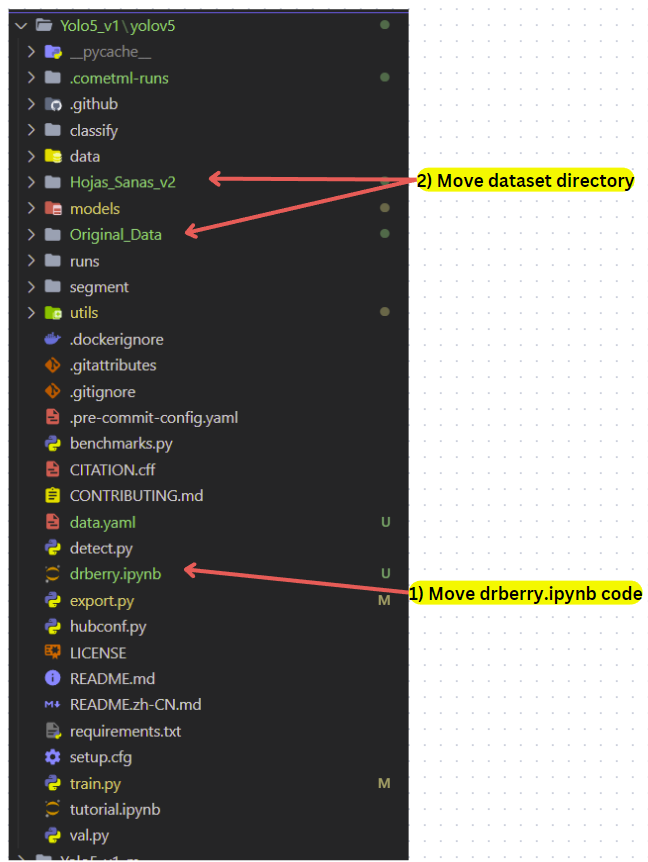

# Folder Structure
---
1) DrBerryCode
* In this we have the code used to train the model and the test that we make.
2) Dataset Original
* In this folder there are the images collected and these doesnt have any label on the data.
3) Dataset with labels
* In this folder we have the images that have labels and data augmentation techniques.

# Important
----
Before running the experiments of DrBerryCode , you need to download the latest version of Yolov5 in <https://github.com/ultralytics/yolov5> .
1. You must enter on yolov5 folder, and you have to move the files downloaded as the following image.

2. Then, in therminal you need to install al the necessary libraries or adding a new block of code inside the drberry.ipynb, "pip install -r requirements.txt", as addition if you want to use comet, you can download with "pip install comet_ml".
3. Finally you can go trought the file drberry.ipynb and train the model with you hardware available.
